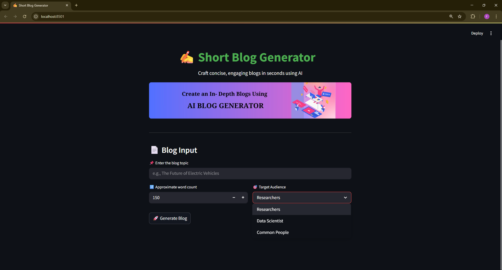
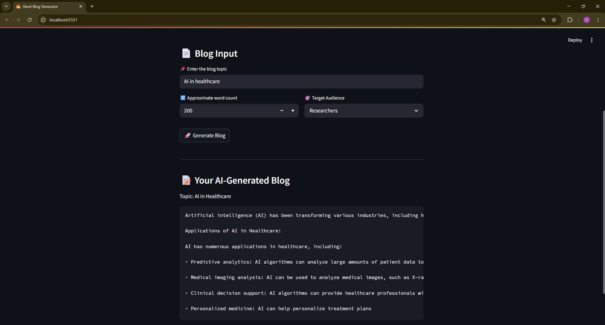
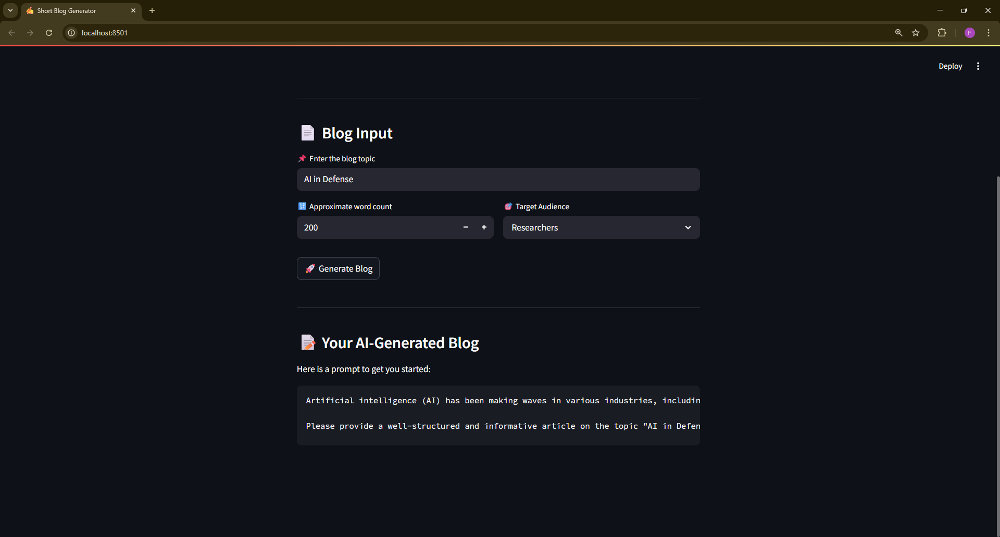

# AI Blog Generator

A simple and intelligent Streamlit-based application powered by LLaMA 2 that generates short, structured, and audience-specific blogs using natural language prompts.

---

## Features

* Generates short blogs instantly
* Audience-specific writing (Researchers, Data Scientists, Common People)
* Custom word count control
* Clean, structured output (Intro, Body, Conclusion)
* Beautiful UI with image header
* Powered by LangChain + LLaMA 2 model (running locally)


---

## Installation & Setup

```bash
# 1. Clone the repository
git clone https://github.com/02priyeshraj/Llama_Blog_Generator.git
cd Llama_Blog_Generator

# 2. Create and activate a virtual environment
python -m venv venv
# Windows:
venv\Scripts\activate
# Linux/macOS:
source venv/bin/activate

# 3. Install required packages
pip install -r requirements.txt

# 4. Run the app
streamlit run app.py
```

---

## Project Structure

```
Llama_Blog_Generator/
│
├── assets/
│   └── header.png              # Header image for UI
│
├── models/
│   └── llama-2-7b-chat.ggmlv3.q8_0.bin   # LLaMA 2 model file
│
├── app.py                      # Streamlit application
├── requirements.txt            # All dependencies
├── .gitignore
└── LICENSE
```

---

## Screenshots





---

## Have Suggestions or Issues?

Feel free to open an issue or submit a pull request on GitHub.

---

## License

MIT © [Priyesh Raj](https://github.com/02priyeshraj)

---
